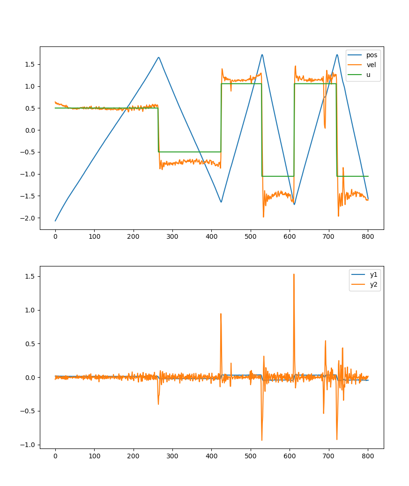

# Analysis of original codebase
## GP Model

- Sample dataset for training GP:
  - Training data: 
  - Testing data:
  - Inputs X can be (pos, vel, u) or (pos, u)
  - Goal output y is $\Delta x$ , y1 discrete difference of pos, y2 discrete difference of velocity
  - X, Y normalized by mean and std_states $\frac{X-\mu}{std}$

- Define action space and observation space
```python
n_actions = 1
n_obs = 2
action_space = spaces.Box(low=-1, high=1, shape=(n_actions,), dtype="float32")
observation_space = spaces.Box(low=-50.0, high=50.0, shape=(n_obs,), dtype="float32")
```
- spaces.Box for dealing with real numbers.

### Training GP Model

- Training loss for GP

```python
# Find optimal model hyperparameters
self.model.train()
self.likelihood.train()
# Use the adam optimizer
optimizer = torch.optim.Adam(
	[
	# Includes all submodel and all likelihood parameters
	{"params": self.model.parameters()},
	],
	lr=0.1,
)
# "Loss" for GPs - the marginal log likelihood
mll = gpytorch.mlls.ExactMarginalLogLikelihood(self.likelihood, self.model)
for i in range(training_iter):
	# Zero gradients from previous iteration
	optimizer.zero_grad()
	# Output from model
	output = self.model(self.X)
	# Calc loss and backprop gradients
	loss = -mll(output, self.Y)
	loss.backward()
	optimizer.step()
```

## Feedforward model

- Use Linear model:

```python
self.linearModel = torch.nn.Linear(
	self.state_dim, self.control_dim, device=self.device, dtype=self.dtype
)
self.saturation = torch.nn.Hardtanh()
self.controller = torch.nn.Sequential(self.linearModel, self.saturation)

```

```python
self.controller = torch.nn.Sequential(
	torch.nn.Linear(
		self.state_dim,
		self.NNlayers[0],
		device=self.device,
		dtype=self.dtype,
	),
	torch.nn.Linear(
		self.NNlayers[0],
		self.NNlayers[1],
		device=self.device,
		dtype=self.dtype,
	),
	torch.nn.Linear(
		self.NNlayers[1],
		self.control_dim,
		device=self.device,
		dtype=self.dtype,
	),
	torch.nn.Hardtanh(),
)
```

- `NNlayers` defined in `config.py`

- The GP Model:

```python
self.likelihood = gpytorch.likelihoods.MultitaskGaussianLikelihood(
num_tasks=2
).to(device=self.device, dtype=self.dtype)
self.model = BatchIndependentMultitaskGPModel(
self.X, self.Y, self.likelihood
).to(device=self.device, dtype=self.dtype)

```

- `BatchIndependentMultitaskGPModel` is:

```python
class BatchIndependentMultitaskGPModel(gpytorch.models.ExactGP)
```

- ExactGP Model definition: 

## Optimize policy

- goal state predefined, (x - goal_state) to get error, if smaller than acceptable steady-state error then goal is met
- step function definition:

```python
def step(self, u):
	x = self.state[self.kStep]
	# concatenate (x,u) for GP input
	u = torch.tensor(u, dtype=float_type)
	X_ = torch.cat((self.obs_torch, u))  # //TODO fix concat
	# take step
	self.state_difference_torch = self.predict(X_[None, :])
	self.obs_torch = self.obs_torch.add(self.state_difference_torch)
	self.obs_numpy = self.obs_torch.numpy()
	self.state[self.kStep + 1] = self.obs_numpy
	self.kStep += 1
	# set outputs
	reward = self.getReward(self.obs_numpy[0])
	self.reward[self.kStep] = reward
	self.checkDone()
	return self.obs_numpy, reward, self.done, {}
```

- initial state is zeros with shape (Horizon, n_states)
- start from kStats=0, update state every step,
- predict() function used to get next step, update with:

```python
observed_pred = self.likelihood(self.model(X_))
```
